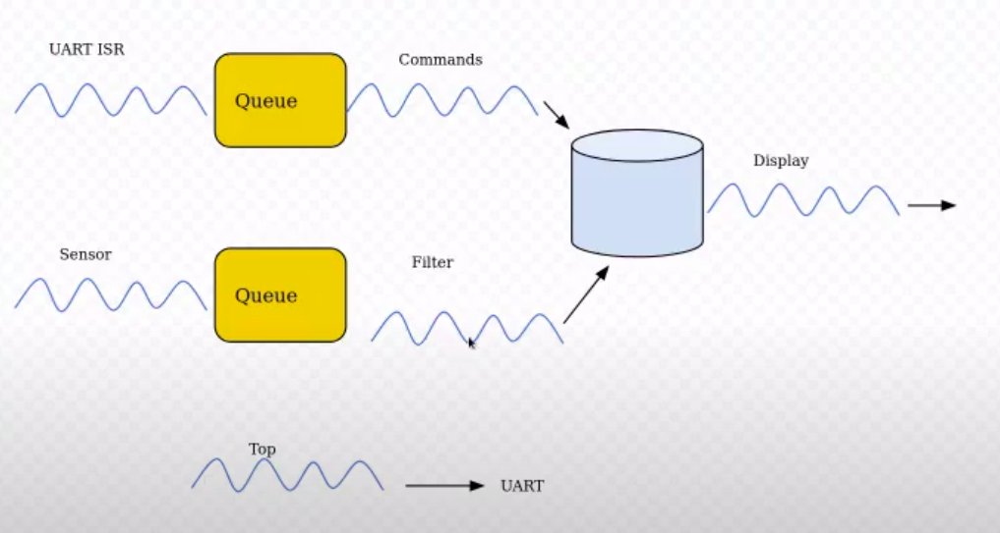
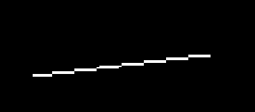
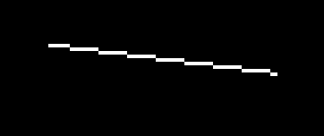

### TP4 Sistemas Operativos II - Wortley Agustina
## INFORME
# Sistemas Operativos de Tiempo Real

## Introducción
Toda aplicación de ingenierı́a que posea requerimientos rigurosos de tiempo, y que esté controlado por un sistema de computación, utiliza un Sistema Operativo de Tiempo Real (RTOS, por sus siglas en inglés). Una de las caracterı́sticas principales de este tipo de SO, es su capacidad de poseer un kernel preemtive y un scheduler altamente configurable. Numerosas aplicaciones utilizan este tipo
de sistemas tales como aviónica, radares, satélites, etc. lo que genera un gran interés del mercado por ingenieros especializados en esta área.

## Objetivo
El objetivo del presente trabajo práctico es que el estudiante sea capaz de
diseñar, crear, comprobar y validar una aplicación de tiempo real sobre un
RTOS.

## Requisitos
-----------
Utilizando [qemu][quemu], emulando un sistema [Stellaris LM3S811][Stellaris], se desarrollo una aplicación basada en FreeRTOS[3] con diferentes tareas, siguiendo el esquema:

En primera instancia se monto el escenario de desarollo implementando el Demo

## IMPLEMENTACION
-----
Desarrollo de las tareas:

1. ### **Sensor**
Esta tarea debe simular un sensor de temperatura. Generando valores aleatorios, con una frecuencia de 100 Hz.

Se utilizo una variable que aumenta hasta 100 y luego disminuye.
Se envia mediante la funcion xQueueSend, utilizando la cola xValueQueue, el valor de la temperatura, de tipo entero.
Y se establece un tiempo de espera con la funcion vTaskDelay(10)

2. ### **Filtro Pasabajo**
Tarea que reciba los valores del sensor y aplique un filtro pasa bajos. Donde cada valor resultante es el promedio de las ultimas N mediciones.

Se reciben los valores de temperatura enviados por la Task del sensor, con la funcion xQueueReceive, utilizando la cola xValueQueue, en una variable de tipo entero.
Se almacenan los valores recibidos de temperatura en un arreglo de N=10 lugares, moviendo este un lugar hacia la derecha, para eliminar el valor mas viejo que esta en la ultima posicion, e ingresando en la primera posicion del arreglo el valor mas nuevo.
Luego se saca el promedio de los ultimos 10 valores y se envian a la siguiente tarea que es la de Graficacion, de igual forma con la funcion xQueueSend, utilizando la cola xValueQueue.

3. ### **Graficador**
Tarea que grafica en el display los valores de temperatura en el tiempo.

Se reciben los valores dedesde el filtro , con la funcion xQueueReceive y la cola xValueQueue, en una variable de tipo entero.
Tenemos un LCD de 64 columnas y 2 filas, con 8 bits por fila.
Para encender los pixeles necesarios se escribe en un arreglo de 128 lugares, con un 1 en los pixeles que se desean encender.
Obtenemos como resultado una onda sinusoidal.

4. ### **UART**
Se debe poder recibir comandos por la interfaz UART para cambiar el N del filtro.

5. ### **Stack**
Calcular el stack necesario para cada task. Realizar el análisis utilizando uxTaskGetStackHighWaterMark o  ApplicationStackOverflowHook.

Se utilizo la funcion uxTaskGetStackHighWaterMark que retorna la cantidad de espacio libre en el stack de una tarea.
Se hace la diferencia entre este valor retornado y el tamaño de stack asignado en la creacion de una tarea, obteniendo asi el valor del stack necesario para la tarea.

6. ### **Top**
Implementar una tarea tipo top de linux, que muestre periódicamente estadı́sticas de las tareas (uso de cpu, uso de memoria, etc).

## BIBLIOGRAFIA
---

[quemu]: www.qemu.org
[Stellaris]: https://www.ti.com/lit/ds/symlink/lm3s811.pdf?ts=1623261610050refurl=httpshttps://www.freertos.org/

// http://www.strudel.org.uk/itoa/